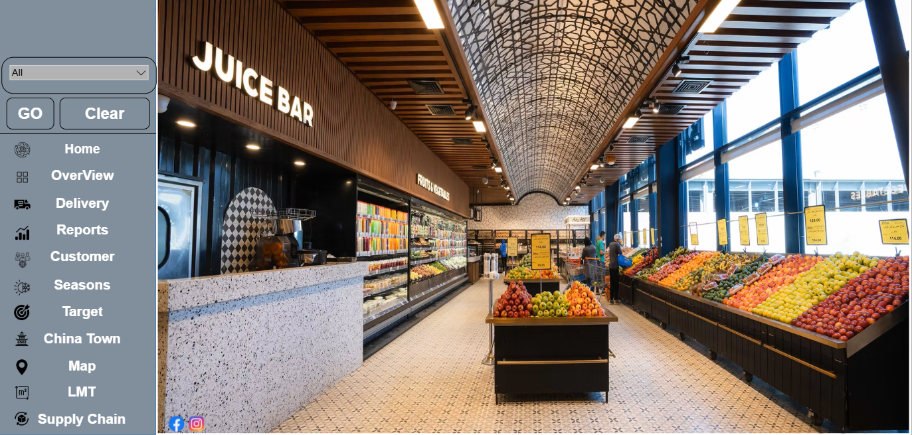

# Muhammad Elbishbieshy

Retail Data Analyst

## Dashboard Preview

## Projects

### Retail Sales Dashboard
Power BI dashboard analyzing retail sales performance.

### Branch Performance Analysis
Retail branch KPI analysis and performance comparison.

### Sales per Linear Meter Analysis
Shelf space productivity analysis.

### Retail Productivity Analysis
Branch and employee productivity evaluation.

## Portfolio Details

[View Portfolio Details](portfolio.html)

## License

[MIT License](LICENSE)
